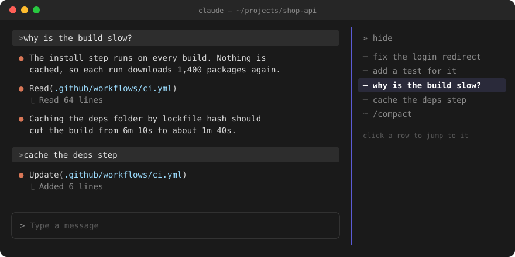
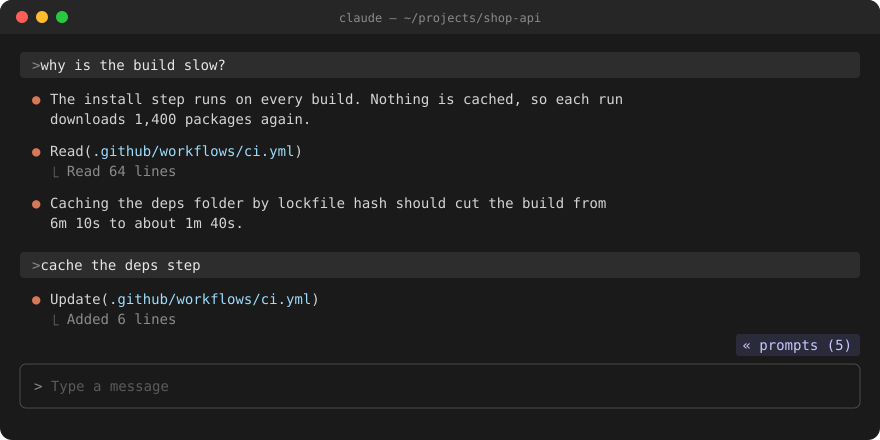
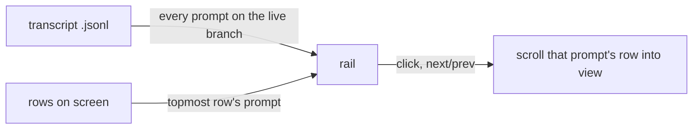

<div align="center">

# cc-cli-rail

**Every prompt of your Claude Code session, in a rail beside the transcript.**
Click one to jump back to it. Hide the rail when you need the room.


[](https://github.com/oikon48/prompt-rail)

<a href="docs/demo.mp4"></a>

<sub>Silent preview. <a href="docs/demo.mp4">Watch the MP4</a> with sound.</sub>

</div>

## Install

Inside Claude Code:

```
/plugin marketplace add afu-it/cc-cli-rail
/plugin install cc-cli-rail@afu-it
```

Or from your shell:

```bash
claude plugin marketplace add afu-it/cc-cli-rail
claude plugin install cc-cli-rail@afu-it
```

Start a new session. The rail opens on its own.

> [!NOTE]
> Function hooks are early access. If the rail does not show, add this to `~/.claude/settings.json` and start a new session:
>
> ```json
> { "env": { "CLAUDE_CODE_ENABLE_FUNCTION_HOOKS": "1" } }
> ```

> [!TIP]
> Mouse works best with `"tui": "fullscreen"`. On a narrow window Claude Code may hold the rail back at the start of a session; press `« prompts (N)` above the input to open it.

### Already using prompt-rail?

Turn it off first, or two rails open side by side:

```bash
claude plugin disable prompt-rail@oikon48
```

## Hide and show

The rail takes a column of your screen. When you need it back, hide it.

<div align="center">

</div>

<div align="center">

</div>

| To | Do |
| --- | --- |
| Hide the rail | Click `» hide` in the bottom-right corner of the rail, or its close mark |
| Show it again | Click `« prompts (N)` above the prompt input |
| Toggle from the keyboard | `/cc-cli-rail`, or bind `cc-cli-rail-toggle` to a key |

The rail stays hidden in new sessions until you show it again.

## Commands

| Command | What it does |
| --- | --- |
| `/cc-cli-rail` | Hide the rail, or show it |
| `/cc-cli-rail show` · `hide` · `toggle` | Show, hide, or flip it |
| `/cc-cli-rail next` · `prev` | Jump to the next or previous prompt |
| `/cc-cli-rail first` · `last` | Jump to the first or newest prompt |
| `/cc-cli-rail 12` · `#12` | Jump to prompt #12 |
| `/cc-cli-rail find <words>` | Jump to the newest prompt that holds the words |
| `/cc-cli-rail-next` · `-prev` · `-toggle` | The same with no argument, for a keybinding |

### Keyboard

Bind the commands in `~/.claude/keybindings.json`. They run mid-turn too. `command:cc-cli-rail-toggle` works the same way on any free key.

```json
{
  "bindings": [
    {
      "context": "Chat",
      "bindings": {
        "ctrl+k": "command:cc-cli-rail-prev",
        "meta+j": "command:cc-cli-rail-next"
      }
    }
  ]
}
```

## Reading the rail

| Tick | Meaning |
| --- | --- |
| `━` **bold** | The prompt you are reading now |
| `─` | Any other prompt |
| `┄` | A prompt Claude Code would not scroll to, such as a `/compact` row. `next` and `prev` skip it |

The rail follows you as you scroll: the prompt that owns the top row on screen is the one in bold.

## What is different from prompt-rail

| | prompt-rail | cc-cli-rail |
| --- | --- | --- |
| Layout | Horizontal bars or vertical pane | Vertical pane only |
| Hide the rail | `/prompt-rail off` | `» hide` button, close mark, or `/cc-cli-rail` |
| Bring it back | `/prompt-rail vertical` | `« prompts (N)` button above the prompt |
| Prompt sent mid-turn (ctrl+enter, queued) | Can show twice, the copy dotted | Shows once |
| Setting in `/config` | Rail mode row | None; the hidden or shown choice is remembered |

<details>
<summary><b>How it works</b></summary>

<br>



The rail lists the prompts of the live branch, so prompts abandoned with `/rewind` drop out, and prompts from before a resume are listed too. A prompt drawn on screen before the transcript stores it is matched to its stored row, and dropped once the file lists the same text. The transcript is read again only when its size or time changed.

</details>

<details>
<summary><b>Known limits</b></summary>

<br>

- Function hooks are early access, and their API may change between Claude Code releases.
- The Claude desktop app cannot scroll its transcript for a plugin, so a click there does not jump.
- The dock width is shared by all plugin panes. Drag its edge to narrow it, down to 24 columns. Below 12 columns the rail shows ticks only, and hovering one shows its prompt above the input.
- A `/compact` row cannot be jumped to. Its tick turns dotted after the first try.
- Near the end of the transcript, `next` cannot scroll further.

</details>

## Development

```bash
git clone https://github.com/afu-it/cc-cli-rail
claude --plugin-dir cc-cli-rail      # load this checkout; saving a file reloads it
claude plugin validate cc-cli-rail
claude plugin test cc-cli-rail       # 101 tests
```

## Credit

cc-cli-rail is a fork of **[prompt-rail](https://github.com/oikon48/prompt-rail) by [oikon48](https://github.com/oikon48)**. The transcript reading, the tracking of what you are reading, and the jump logic are oikon48's work. Thank you.

## License

[MIT](LICENSE). Copyright (c) 2026 oikon48, with changes by afu-it.
